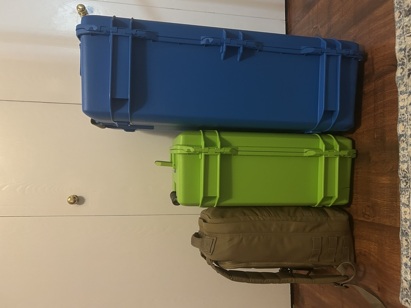
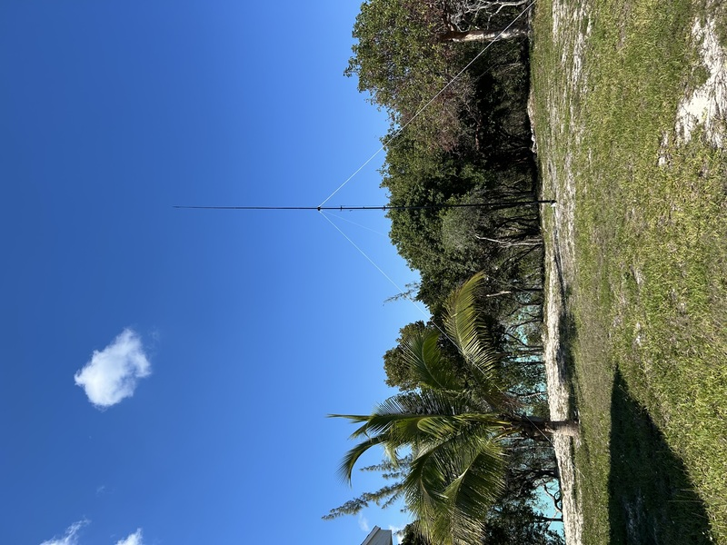
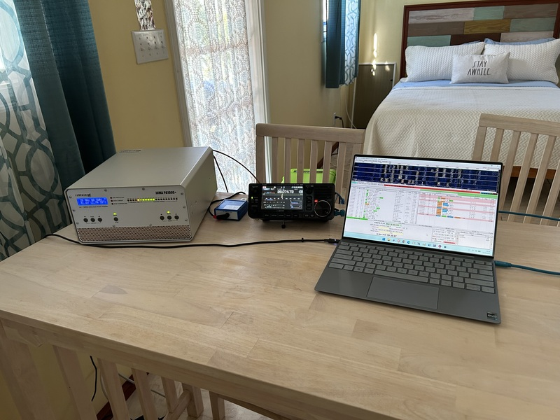

This post was written after the fact and captures the travel, arrival, and initial station setup for my first DXpedition to Eleuthera Island, Bahamas.

## Travel to Eleuthera

Travel logistics went largely as planned. The station was divided into three bags: a Pelican 1535 carry‑on for all critical electronics, a small personal bag for the laptop and accessories, and a Pelican 1615 checked bag for antennas, mast, coax, and tools. Keeping the radio and amplifier with me eliminated any anxiety about loss or damage in transit.

Airline and airport handling were uneventful, and none of the radio equipment raised concerns during security screening. Once on Eleuthera, the car rental was waiting for me and travel to the cottage was straightforward, and all gear arrived intact.

## First Look at the QTH

Upon arrival, the first order of business was assessing the available space. The cottage had reasonable outdoor space, but like many rental properties, antenna placement options were more constrained than they first appeared. Power lines were present nearby, and the house itself sat closer to the usable antenna area than ideal.
At this point, the goal was simply to get everything assembled and on the air, then adjust as necessary based on real‑world behavior rather than assumptions.

## Antenna Deployment

The multiband vertical for 40, 20, 15, and 10 meters was deployed on a Spiderbeam mast not far from the cottage. Radials were installed, and initial SWR results were acceptable across all bands.

This first placement worked well enough to get on the air immediately, but it quickly became clear that antenna distance from the house would be an important variable. RF made its presence known inside the cottage, and while things worked, it was obvious improvements were possible.
Over the following day, the antenna was relocated farther from the building, ultimately ending up roughly 90 feet from the cottage. This significantly reduced RF issues, improved usability on all bands, and turned out to be one of the most important setup decisions of the trip.

## Station Assembly                                                                                                                                                                                                                                                                                                                                                                                                   Initial station assembly went smoothly. The IC‑705, JUMA PA‑1000+, and support equipment were up and running quickly, with all interconnections behaving exactly as tested at home. From opening the first case to a powered‑on station took about an hour.
The radio configuration and logging environment were already dialed in before departure, which helped keep initial setup focused on physical layout rather than software troubleshooting.

## First QSOs

With the station operational, initial contacts came quickly. Digital modes were used first to confirm transmit and receive performance, and early results were encouraging. The combination of location, antenna, and timing produced strong responses on the air, confirming that the basic setup was sound.
By the end of the first operating day, it was clear that the station was not just functional, but capable of sustaining long operating sessions and handling pileups efficiently.

## Looking Back

In hindsight, the biggest lesson from the travel and setup phase was the value of flexibility. While the equipment and packing plan worked exactly as intended, real‑world antenna placement required adjustment once RF realities became apparent.
Taking the time to move the antenna and clean up RF issues early paid dividends for the rest of the operation. Once those changes were made, the station required very little attention, allowing nearly all effort to be focused on operating rather than troubleshooting.
