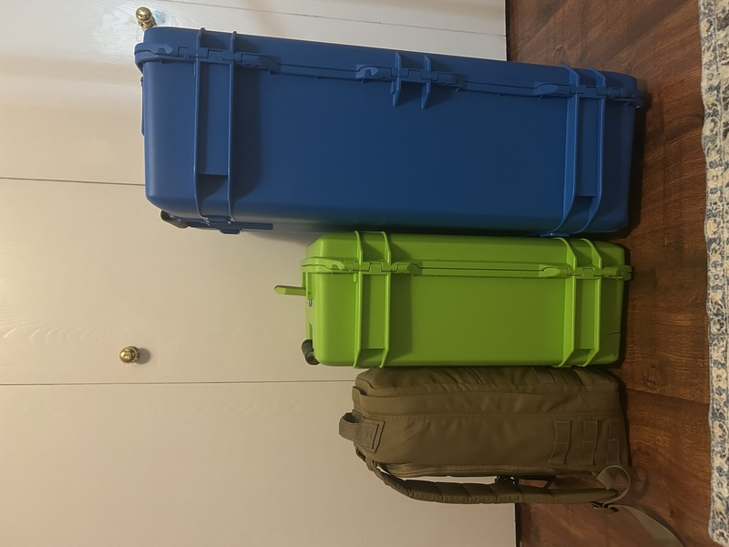
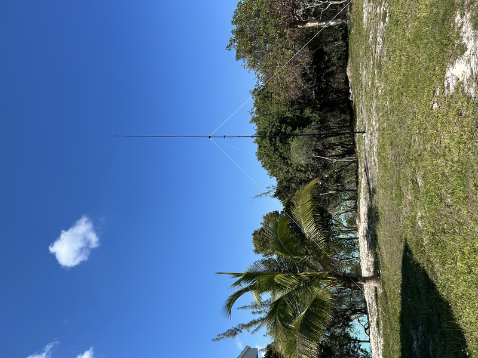
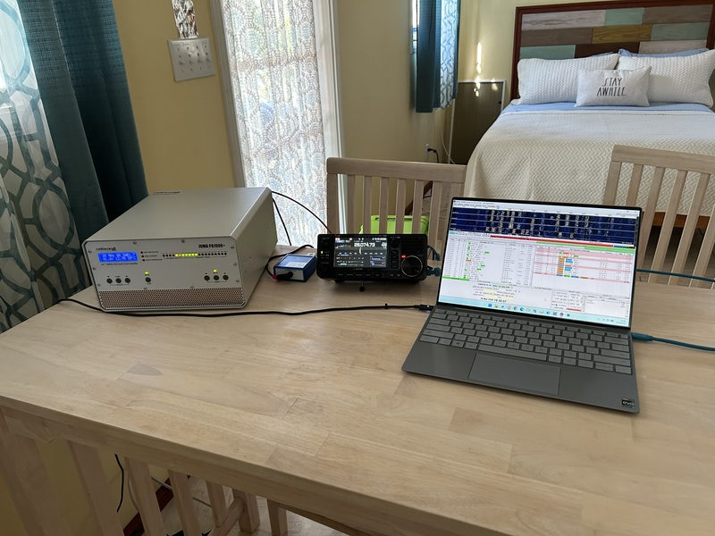

I flew with the same three bags I packed at home: Pelican 1535 carry-on for the radio and amp, a personal bag for the laptop and small stuff, and a Pelican 1615 checked with the antenna, mast, coax, and tools. The IC-705 and JUMA stayed with me. I was not checking those.

Security had questions about the radio gear. I got through. On Eleuthera the rental car was waiting, I drove to the cottage, and everything showed up in one piece.

## First look at the QTH

The cottage has some outdoor space, but once I walked it, antenna options were tighter than they looked from the pics. Power lines nearby, and the house sits closer to the only decent antenna area than I'd like.

I decided to get on the air first and move things if I had to.

## Antenna

I put the 40, 20, 15, and 10 meter vertical up on the Spiderbeam mast not far from the cottage, laid radials, and SWR was fine on all four bands.

## Station

With the antenna up, the IC-705, JUMA PA-1000+, and the rest went together the same way they did at home. First case open to a live station: about an hour.

Radio config and logging were already set before I left, so this part was just the physical layout.

## First QSOs

I started on digital to make sure TX and RX were actually working. Contacts came quickly. The basic setup works.
