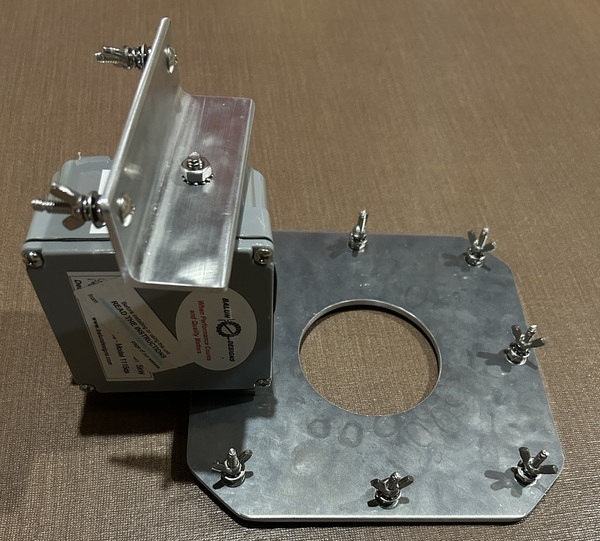

I've designed the antenna system used by our club and we have already successfully run two stations on 20m and two stations on 40m for [ARRL Field Day](https://www.arrl.org/field-day). This is the fifth antenna, and it gives us two bands: 80m at night and 15m during the day.

I looked at loaded inverted-Ls, EFHWs, inverted-Vs, and shortened verticals. I ended up with a full-size quarter-wave 80m inverted-L and a separate 15m quarter-wave vertical on the same feedpoint.

## 80 meters

The [Spiderbeam 12m XHD](https://shop.spiderbeam.com/en/shop/spiderbeam-12m-xhd-set2-2406) mast gives me about 40 feet of vertical. A second section slopes off the top so the whole radiator is near a quarter wave on 80m, about 65 feet: 40 up and 25 out.

I wanted that instead of a low inverted-V because I get some low-angle and some higher-angle radiation, and there isn't a loading coil in the wire. The ground system is the same one the 15m vertical uses.

## 15 meters

A dedicated quarter-wave vertical hangs off the same feedpoint, held out with a small nonconductive standoff on the mast.

15m is a daylight band. When 80m comes alive in the evening, 15m is usually done anyway. A resonant 15m wire means I'm not trying to make the 80m inverted-L play on 15m.

## Radials

This is the part I didn't want to cheap out on. I made a radial plate out of 8" square 3/16" thick aluminum plate, 7 connection points for the radials and a hole to attach a [Feedline Choke](https://www.balundesigns.com/model-1115d-isolation-choking-1-1-balun-3-54-mhz-5kw/).

Rather than a handful of long radials, it's:

- 42 radials @ 27.5 feet each
- 22 AWG
- 7 bundles
- 6 radials per bundle

That's almost 1,200 feet of wire. Enough that the ground loss is small and the antennas can actually do the work. Seven identical bundles so I can throw them out without thinking about it on Field Day morning.

## Mast, wire, and not hitting anyone

I am using [DX10 Antenna Wire](https://dxcommander.com/product/dx10-antenna-wire/) for the driven elements.  DX10 is light, floppy wire but plenty large enough for 100 watts.

I went with the 12m XHD instead of the regular 12m Spiderbeam to make sure the side load of the inverted-L radiator doesn't add too much stress at the top.

I use a single set of three guy lines, 9m up the mast.  This is a temporary setup, two sets of guys would be overkill.

The hot part of the wire stops well above head height. Bright yellow Dacron continues from the end of the radiator down to the anchor, so people can see it, and nobody walks into a live end.