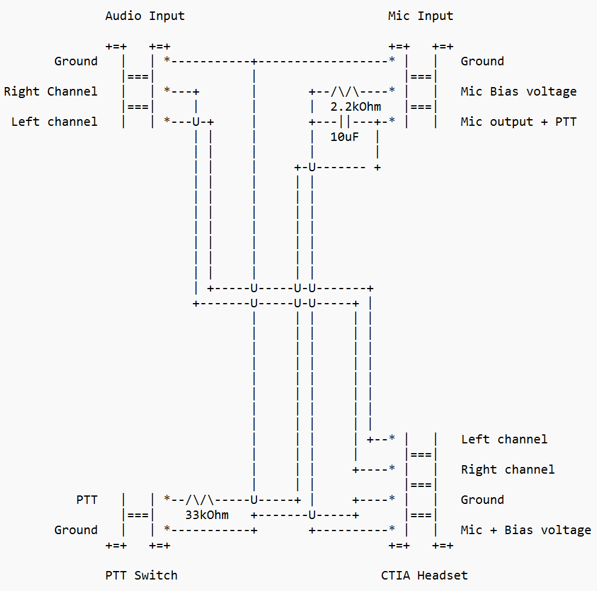
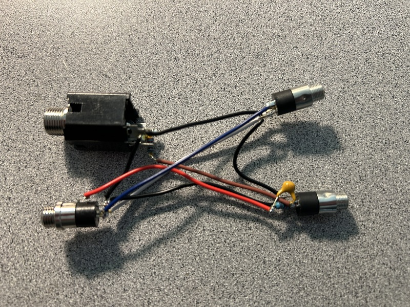
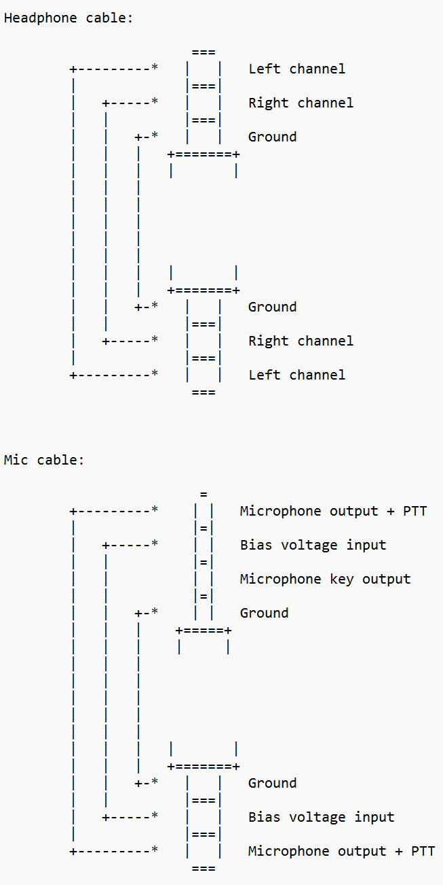
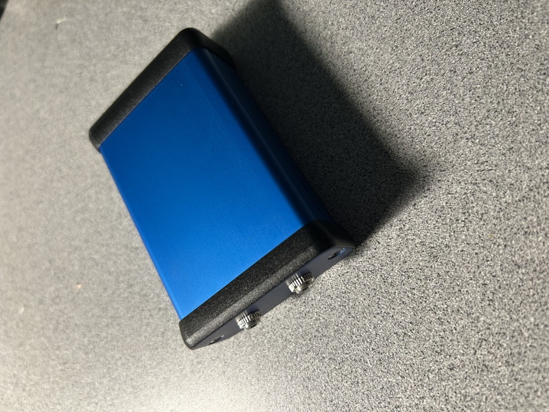
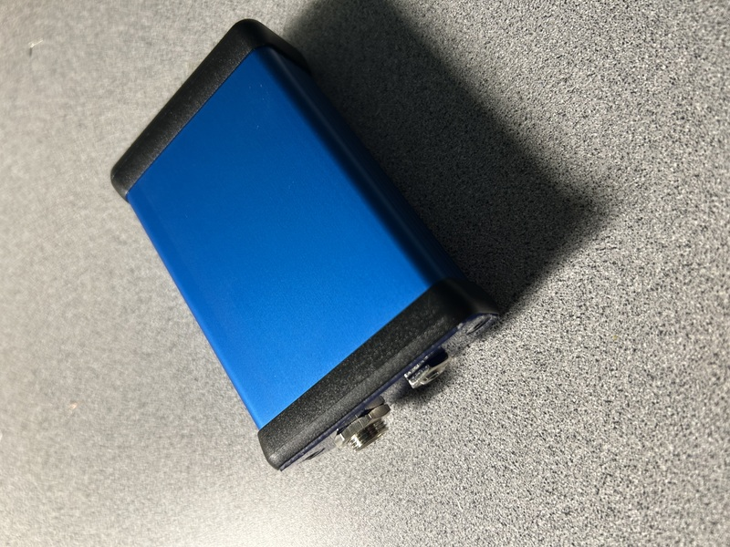

### Background and Motivation

I have been experimenting with wired computer style headsets for amateur radio use, specifically CTIA wired headsets that are common in the mobile phone world. These headsets are lightweight, widely available, and surprisingly good for portable and travel operation.

For this project, I wanted to use a [RadioSport RS55SL SuperLite Travel Headset](http://www.arlancommunications.com/products/amateurRadio/radioSport/rs101555SL.asp) with my [ICOM IC-705](https://www.icomamerica.com/lineup/products/IC-705/). The RS55SL is wired with a CTIA TRRS plug and they also sell an adapter that provides a built‑in push‑to‑talk button.

While that works fine for casual use, my operating style leans heavily toward foot‑pedal PTT because of longer operating sessions and DXpeditions. A foot pedal allows me to keep hands on the radio or logging keyboard and reduces fatigue during extended runs.

The result is a small converter box that:

- Accepts a CTIA wired headset
- Interfaces cleanly with the IC‑705 mic and headphone connectors
- Provides microphone bias and PTT handling
- Allows PTT to be controlled by an external foot pedal instead of an inline button

---

### Overall System Architecture

The project breaks down into two parts:

1. CTIA headset conversion circuit
2. IC‑705 interface cabling

The circuit is housed in a compact Hammond 1455C801BU extruded aluminum enclosure, which is small enough for portable use but rugged enough for travel.  Cabling could be created for any radio in the future.

---

### CTIA Headset Conversion

CTIA headsets combine left audio, right audio, microphone, and ground on a single TRRS connector. The microphone element also expects a small bias voltage.

The conversion circuit performs several functions:

- Accepts seperate headphone and mic input using standard 3.5mm TRS jacks
- Routes left and right headphone audio
- Couples the microphone audio correctly
- Injects microphone bias
- Routes PTT control to a seperate input for an external foot pedal using a 1/4" jack

Below is the schematic I used for the CTIA interface portion of the project.

And a picture of it assembled, outside the enclosure.

This circuit uses:

- 2.2k ohm resistor to provide proper mic bias current
- Icom PTT detection
- A DC blocking capacitor on the microphone audio
- Common ground reference between audio and PTT

Since I'm focusing on the IC-705 for this, I followed the PTT operating principle published in the October 2020 issue of [Short Break of the FB NEWS Worldwide](https://www.fbnews.jp/202010/ww03/).

This approach keeps the headset electrically happy while presenting clean audio and PTT signaling to the radio.

### IC‑705 Interface Cabling

The IC‑705 uses separate connections for headphone audio and microphone input.  The cabling converts the microphone input from 2.5mm TRRS to 3.5mm TRS, dropping the Microphone key output.

This keeps everything predictable and serviceable in the field.
Below is the cable wiring reference for the IC‑705 connections used in this build.

### Enclosure and Construction

Everything is housed in a [Hammond 1455C801BU](https://www.hammfg.com/part/1455C801BU) extruded aluminum enclosure. This enclosure was chosen because:

- It is compact and backpack friendly
- It provides excellent RF shielding
- End plates are easy to customize for connectors
- It stands up well to travel and field use

Since the CTIA stadard uses Mic + Bias voltage on the shield, and not Ground like all the other jacks, I had to create a plastic end plate to keep it electrically isolated.

### Operating Impressions

Using a lightweight headset with a foot pedal significantly improves comfort for longer operating sessions. For portable operation, the headset reduces ambient noise, and for DXpeditions, the foot pedal makes running stations far less tiring.

This setup has proven reliable, flexible, and easy to integrate with existing IC‑705 accessories.
