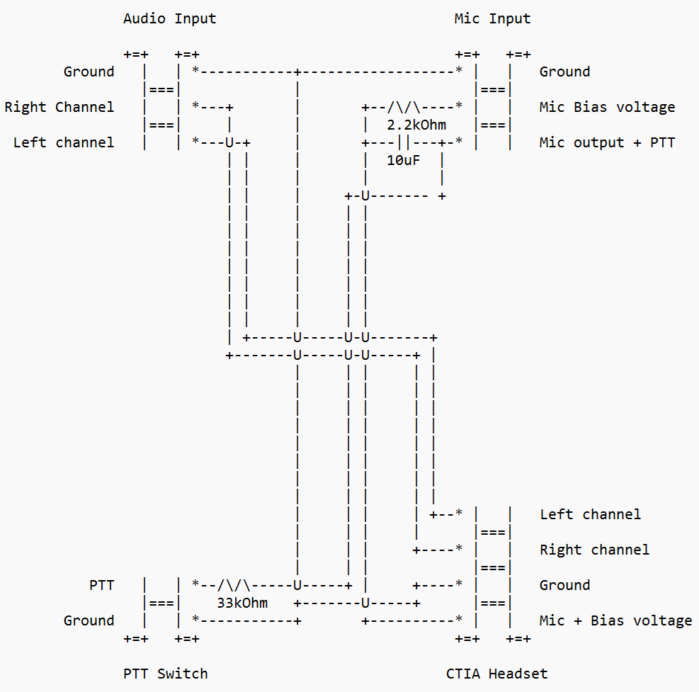
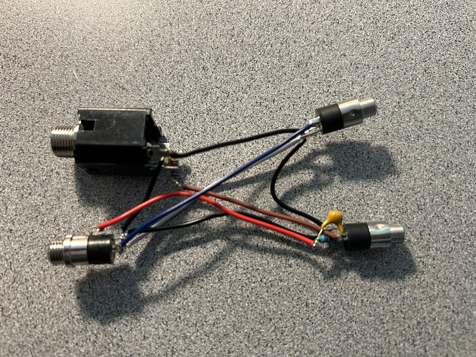
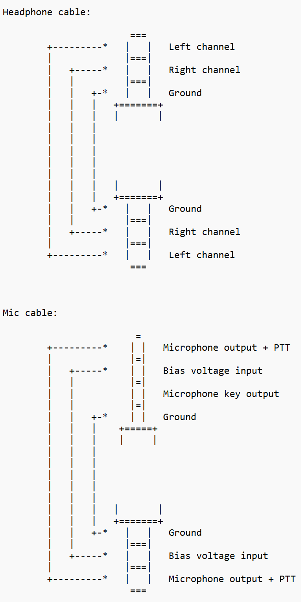
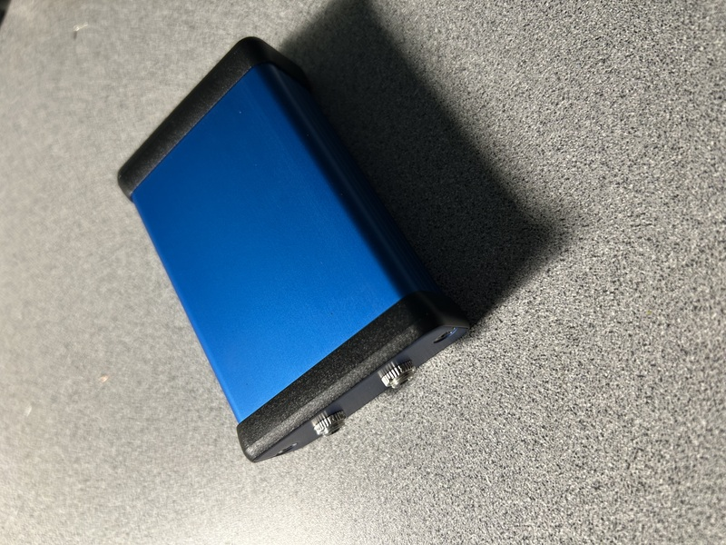
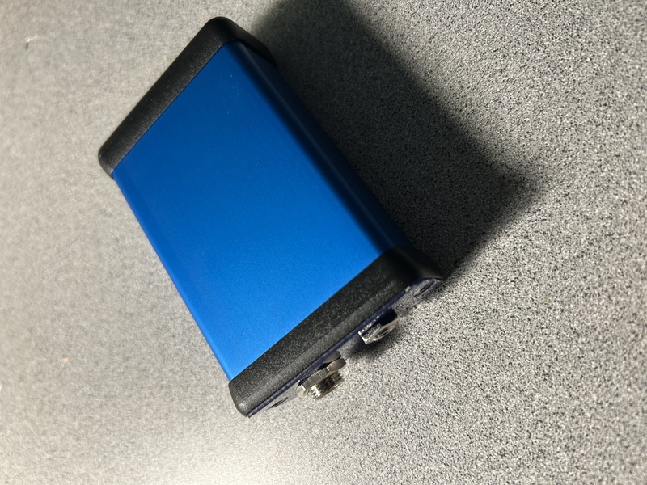

I've been using wired CTIA headsets on the radio. Phone headsets, basically. They're light, easy to find, and better than I expected for portable work.

I wanted a [RadioSport RS55SL SuperLite Travel Headset](http://www.arlancommunications.com/products/amateurRadio/radioSport/rs101555SL.asp) on the [ICOM IC-705](https://www.icomamerica.com/lineup/products/IC-705/). It's a CTIA TRRS plug, and they sell an adapter with a built-in PTT button.

That works fine for casual use. For long sessions and DXpeditions I want a foot pedal. Hands on the radio or the log, less fatigue.

So I built a small box that:

- Takes a CTIA wired headset
- Hooks up to the IC-705 mic and headphone jacks
- Handles microphone bias and PTT
- Lets a foot pedal do PTT instead of the inline button

Two pieces: the conversion circuit, and the IC-705 cables. It lives in a [Hammond 1455C801BU](https://www.hammfg.com/part/1455C801BU). Small enough to pack. I can make cables for other radios later.

## The circuit

CTIA puts left, right, mic, and ground on one TRRS plug. The mic also wants a little bias voltage.

The board:

- Separate 3.5mm TRS jacks for headphones and mic
- Routes left and right headphone audio
- Couples the microphone audio
- Injects mic bias
- 1/4" jack for an external foot pedal

Here's the schematic.

And a picture of it assembled, outside the enclosure.

What's in it:

- 2.2k ohm resistor for mic bias
- Icom PTT detection
- A DC blocking capacitor on the microphone audio
- Common ground between audio and PTT

For the IC-705 PTT, I followed the October 2020 issue of [Short Break of the FB NEWS Worldwide](https://www.fbnews.jp/202010/ww03/).

## IC-705 cables

The IC-705 has separate headphone and mic jacks. The cable takes the mic from 2.5mm TRRS to 3.5mm TRS and drops the microphone key output.

Wiring for this build:

## Enclosure

Hammond extruded aluminum. Small, shields RF, end plates I can drill, and it travels.

CTIA puts Mic + Bias on the shield, not ground like the other jacks, so I made a plastic end plate to keep that jack isolated.

A light headset plus a foot pedal is just more comfortable when I'm running for hours. The headset helps with noise in the field. The pedal is less tiring when I'm the DX.

It works with the rest of the IC-705 stuff I already have.
